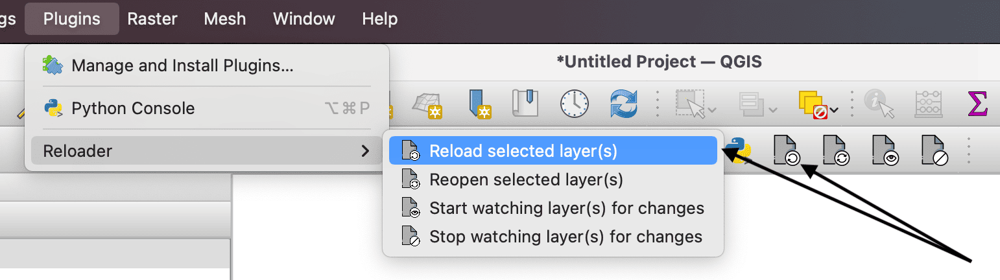

#  QGIS Reloader 
Reload selected layer(s).

Simple utility to reload/reopen selected layer(s). Reloading updates the data,
reopen also updates the extent. Also provides an option to watch layers
for changes to local file paths and reloads them automatically.
Useful when you're editing the underlying data on the fly in some other program.

Layers that use data from watched layers can also be automatically updated when
the watched files change.  To do this open the `Properties` of the dependent
layer (the one using the watched layer's data, not the watched layer itself) in
the `Layers` panel and select the relevant watched layer in the list under
`Dependencies`, then under `Joins` edit the join to the watched layer and make
sure `Cache join layer in memory` is *not* selected.  After doing this the
dependent layer should update automatically when the watched file changes.

